# Hospital Management System User Guide

This guide explains the app roles, visible tabs, and main actions. The app shows different screens based on the logged-in role.

Screenshots are stored in the `Images` folder.

## Role Summary

| Role | Main purpose | Data access | Main restrictions |
| --- | --- | --- | --- |
| Administrative Staff | Manage hospital operations | All patients, all appointments, all patient chats, inventory, reports, vitals, dashboard | Does not use the doctor-only `My Visits` tab or patient-only tabs |
| Nurse | Manage patient care work | All patients, all appointments, all patient chats, vitals, dashboard | No `Inventory` or `Reports` tabs |
| Doctor | Work assigned visits | Assigned patients, assigned appointments, assigned patient chats, vitals for assigned patients | No `Dashboard`, `Inventory`, `Reports`, or unrelated patient records |
| Patient | View personal care | Own care summary, own appointments, own single patient chat | No staff tools and no other patient data |

## Tab Access Matrix

| Area | Administrative Staff | Nurse | Doctor | Patient |
| --- | --- | --- | --- | --- |
| `Login / Register` | Yes | Yes | Yes | Yes |
| `Dashboard` | Yes | Yes | No | No |
| `My Visits` | No | No | Yes | No |
| `My Care` | No | No | No | Yes |
| `Patients` | Yes | Yes | Assigned only | No |
| `Appointments` | Yes | Yes | Assigned only | Own only |
| `Inventory` | Yes | No | No | No |
| `Reports` | Yes | No | No | No |
| `Messages` | Yes | Yes | Assigned only | No |
| `My Messages` | No | No | No | Yes |
| `Vitals` | Yes | Yes | Assigned only | No edit access |
| `Notifications` | Yes | Yes | Related updates | Own updates |
| `Logout` | Yes | Yes | Yes | Yes |

## Example Flows

### Register a New Account

1. From the login screen, click `Register`.
2. Enter `Username`, `Display name`, and `Password`.
3. Choose a `Role`: Doctor, Nurse, Administrative Staff, or Patient.
4. Click `Register`.
5. After the success message, return to the login screen and log in with the new username and password.

### Create an Appointment

1. Log in as Administrative Staff or Nurse. A Patient account can also create an appointment for their own profile.
2. Open the `Appointments` tab.
3. Select the patient from the patient picker.
4. Select the doctor from the doctor picker.
5. Enter the visit reason, appointment date, and appointment time.
6. Leave the status as `Scheduled` for a new visit.
7. Click `Add Appointment`.
8. Use `Refresh List` if the appointment grid does not update immediately.

### Add Vitals

1. Log in as Administrative Staff, Nurse, or a Doctor assigned to the patient.
2. Open the `Vitals` tab.
3. Select the patient.
4. Enter heart rate, blood pressure, oxygen level, temperature, and notes.
5. Click `Add Vitals`.
6. Review the calculated status: `Normal`, `Warning`, or `Critical`.
7. Check `Notifications` if the vitals create an alert.

### Chat With a Patient or Staff

1. Staff users can open the `Messages` tab, click `Start Patient Chat`, choose a patient, type a message, and click `Send Message`.
2. Doctors can also open an assigned patient chat from `My Visits` by clicking `Text Patient`.
3. Patient users open `My Messages`, read staff messages, type a reply, and click `Send Message`.
4. Staff users return to `Messages` to continue the same patient-specific conversation.

### Manage Inventory

1. Log in as Administrative Staff.
2. Open the `Inventory` tab.
3. To add stock, fill in item name, category, quantity, reorder level, and location, then click `Add Item`.
4. To update stock, select an inventory row, change the quantity, reorder level, or location, then click `Save Stock Changes`.
5. To remove stock, select an item and click `Remove Item`.
6. Use `Refresh List` to reload the inventory grid and low-stock list.

## Login and Register

| Field | Details |
| --- | --- |
| Who can view | Anyone before logging in |
| What it shows | Login form, register form, role picker |
| Available actions | Log in, register a new account |
| Who can use actions | Anyone can register as Doctor, Nurse, Administrative Staff, or Patient for this school project |
| Result | After login, only role-allowed tabs appear |

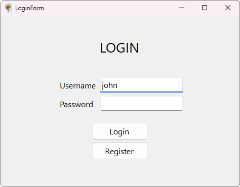

*Login screen: users enter their username and password, then sign in or open registration.*

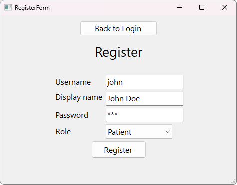

*Register screen: new users enter account details and choose a role before the account is created.*

## Dashboard

| Field | Details |
| --- | --- |
| Who can view | Administrative Staff, Nurse |
| What it shows | Active patients, appointments today, low-stock count, emergency alerts, current alerts |
| Available actions | Review hospital status and watch live updates |
| Who can use actions | Administrative Staff can also see low-stock inventory alerts; Nurse sees patient, appointment, and vitals alerts |
| Demo value | Good first screen for showing real-time hospital status |

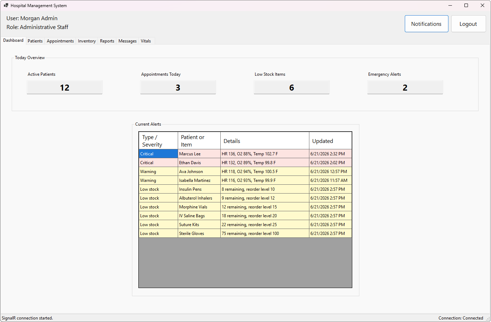

*Dashboard screen: administrative staff and nurses review active patient, appointment, inventory, and alert counts.*

## My Visits

| Field | Details |
| --- | --- |
| Who can view | Doctor |
| What it shows | Today's assigned visits, selected visit details, last completed visit |
| Available actions | Select a visit, review details, click `Text Patient` |
| Who can use actions | Doctor can only open chats for assigned patients |
| Demo value | Shows the doctor-focused workflow before updating an appointment |

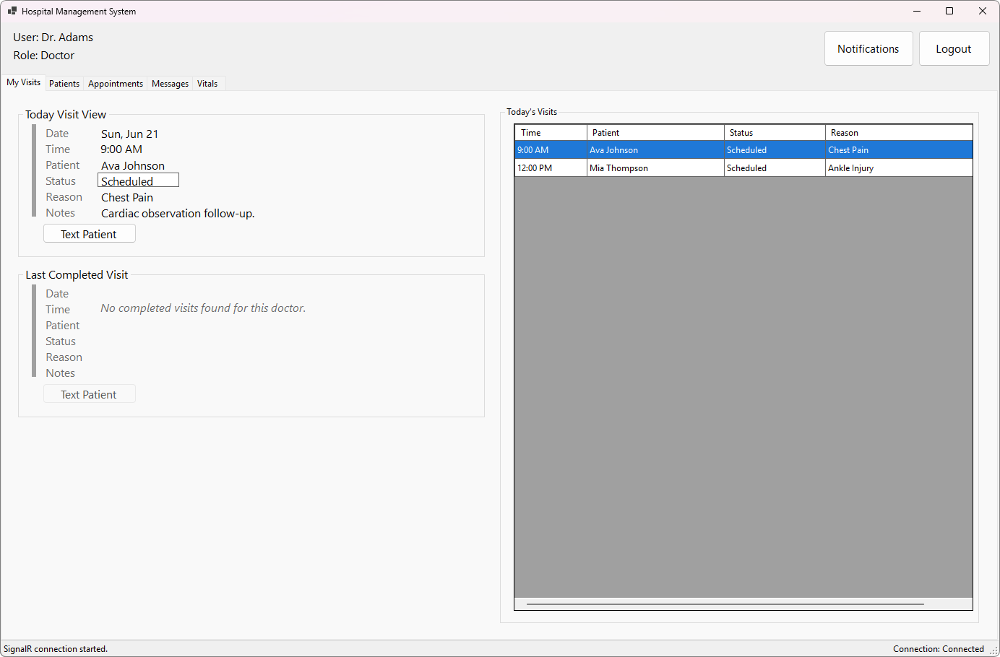

*My Visits screen: doctors review assigned visits, see visit details, and open patient chats from their schedule.*

## My Care

| Field | Details |
| --- | --- |
| Who can view | Patient |
| What it shows | Next appointment, latest vitals, care status, notes |
| Available actions | Review appointment and vitals information |
| Who can use actions | Patient can only view their own information here |
| Demo value | Shows what the patient sees after staff update appointments, admission status, messages, and vitals |

*My Care screen: patients review their next appointment, latest vitals, care status, and notes.*

## Patients

| Field | Details |
| --- | --- |
| Who can view | Administrative Staff, Nurse, Doctor |
| What it shows | Patient list, patient details form, search box, patient filters |
| Available actions | Search, filter, double-click a row, review details, save allowed changes, refresh, clear form |
| Who can use actions | Administrative Staff and Nurse can update accessible patient details; Doctor can view assigned patients only |
| Important labels | `Currently Admitted`, `Save Changes`, `Clear Form`, `Refresh` |

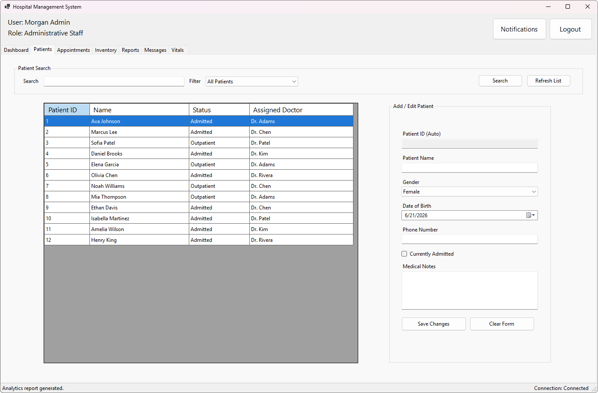

*Patients screen: staff search and filter patients, open records, and save allowed detail changes.*

## Appointments

| Field | Details |
| --- | --- |
| Who can view | Administrative Staff, Nurse, Doctor, Patient |
| What it shows | Appointment list and appointment form |
| Available actions | Add appointment, double-click appointment, update status/notes, refresh, clear form |
| Who can use actions | Administrative Staff and Nurse can create/manage appointments; Patient can create own appointment; Doctor can update status and notes for assigned appointments |
| Important statuses | `Scheduled`, `Checked In`, `Completed`, `Cancelled`, `Rescheduled` |
| Important behavior | Setting status to `Completed` sends an automatic follow-up message to the patient chat |

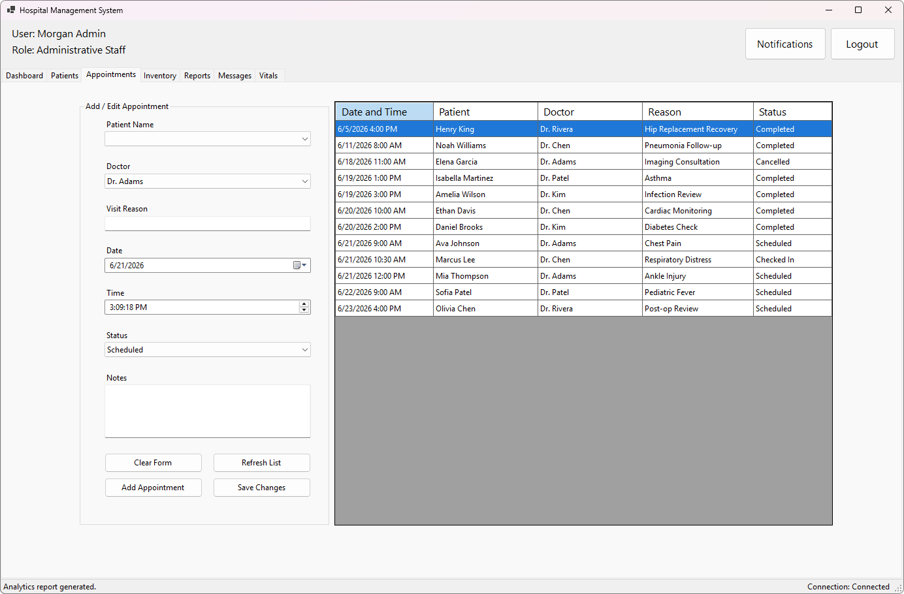

*Appointments screen: users create or manage appointments according to their role and access level.*

## Inventory

| Field | Details |
| --- | --- |
| Who can view | Administrative Staff |
| What it shows | Inventory grid, low-stock list, inventory item form |
| Available actions | Add item, update quantity, update reorder level, update location, remove item, refresh |
| Who can use actions | Administrative Staff only |
| Demo value | Shows stock tracking, low-stock alerts, and inventory notifications |

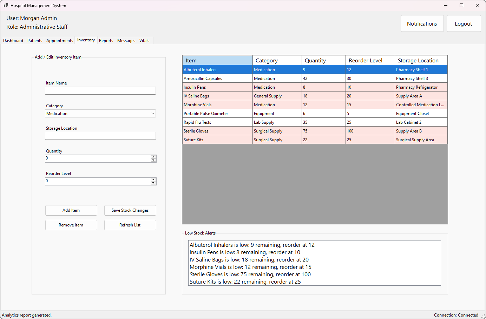

*Inventory screen: administrative staff track stock levels, low-stock items, and inventory updates.*

## Reports

| Field | Details |
| --- | --- |
| Who can view | Administrative Staff |
| What it shows | Date filters, report type picker, report summary, report output grid |
| Available actions | Choose report type and click `Run Report` |
| Who can use actions | Administrative Staff only |
| Report types | `Patient Visits`, `Common Ailments`, `Medication Usage` |

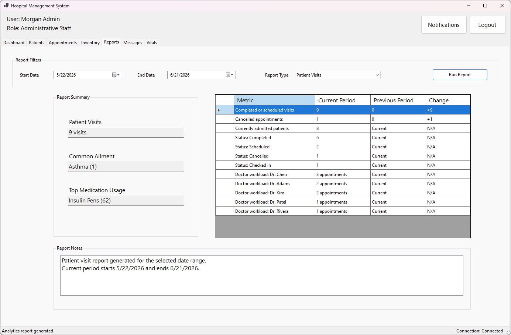

*Reports screen: administrative staff choose a report type and date range, then review generated report results.*

## Messages

| Field | Details |
| --- | --- |
| Who can view | Administrative Staff, Nurse, Doctor |
| What it shows | Patient conversation list, selected conversation history, message input |
| Available actions | Start patient chat, select conversation, send message |
| Who can use actions | Administrative Staff and Nurse can use all patient chats; Doctor can use assigned patient chats |
| Important behavior | Staff chats are patient-specific conversations named like `Patient: <patient name>` |

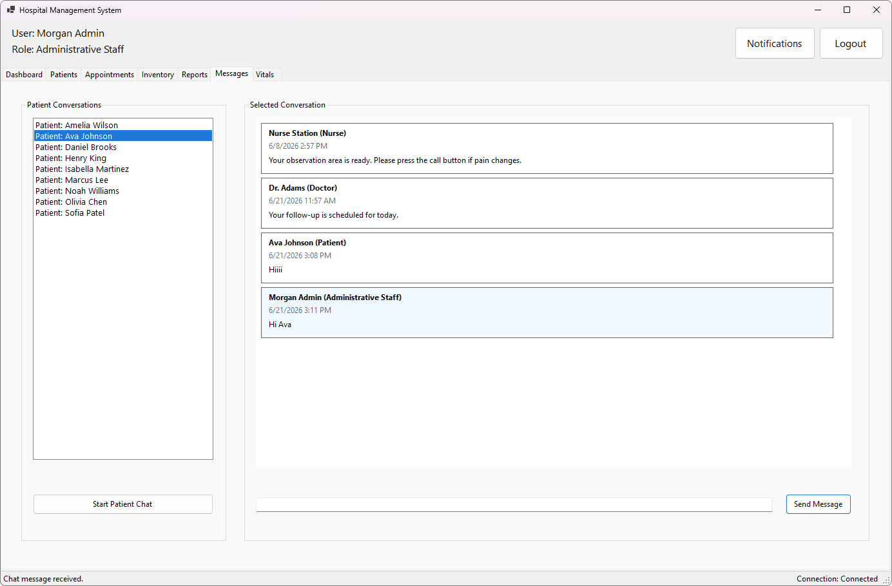

*Messages screen: staff select patient-specific conversations and exchange messages with patients.*

## My Messages

| Field | Details |
| --- | --- |
| Who can view | Patient |
| What it shows | One patient chat for the logged-in patient |
| Available actions | Read messages from staff and send a reply |
| Who can use actions | Patient only |
| Important behavior | Patients cannot create multiple chats; their chat is created automatically |

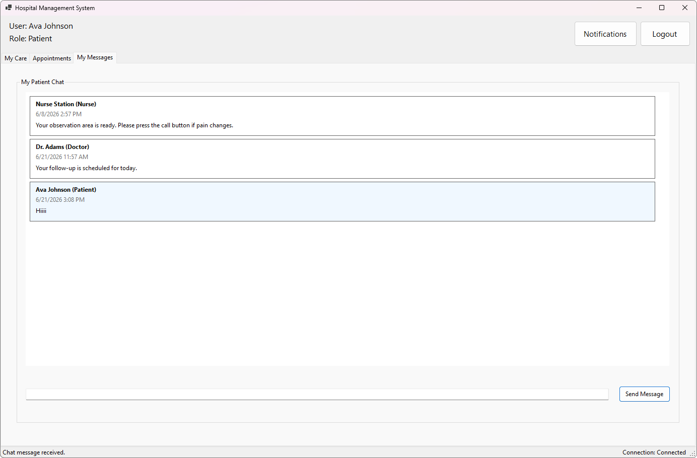

*My Messages screen: patients read staff messages and reply in their own patient-specific conversation.*

## Vitals

| Field | Details |
| --- | --- |
| Who can view | Administrative Staff, Nurse, Doctor |
| What it shows | Vitals grid, vitals alert list, vitals entry form |
| Available actions | Add vitals, double-click vitals row, update vitals, refresh, clear form |
| Who can use actions | Administrative Staff and Nurse can update accessible patients; Doctor can update assigned patients |
| Status results | `Normal`, `Warning`, or `Critical` |
| Important behavior | `Warning` and `Critical` vitals create alerts and notifications |

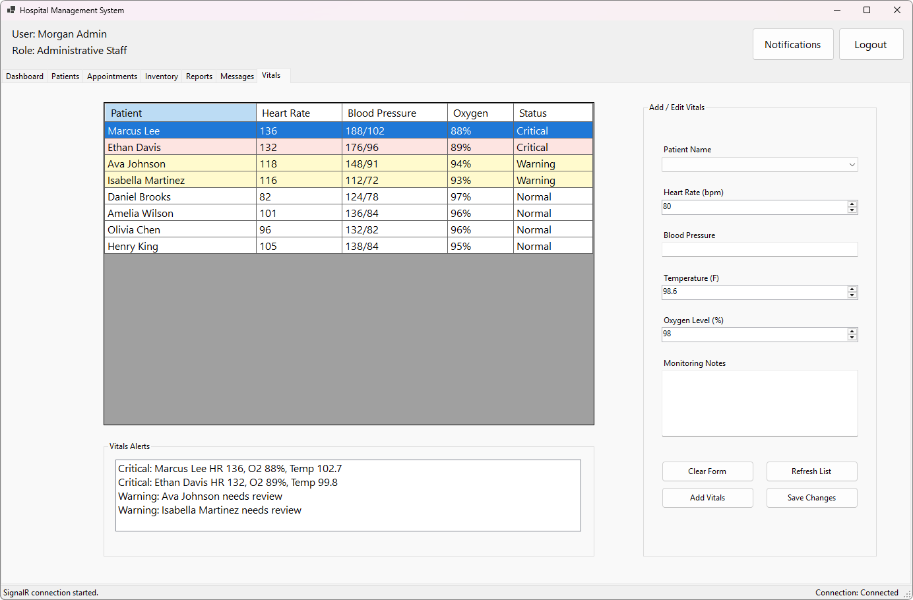

*Vitals screen: staff enter patient vitals, review status results, and monitor warning or critical alerts.*

## Notifications

| Field | Details |
| --- | --- |
| Who can view | All logged-in users |
| What it shows | Recent updates allowed for the current role |
| Available actions | Click `Notifications` in the header and review updates |
| Who can use actions | All logged-in users |
| Role filtering | Administrative Staff and Nurse see broad updates; Doctor sees assigned-patient updates; Patient sees own-care updates |

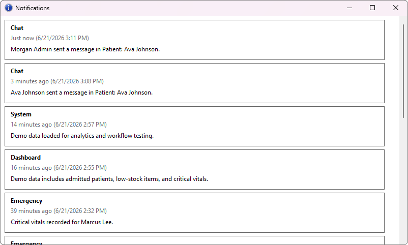

*Notifications screen: users review recent updates filtered to the information their role is allowed to see.*

## Logout

| Field | Details |
| --- | --- |
| Who can view | All logged-in users |
| What it shows | `Logout` button in the header |
| Available actions | Click `Logout` |
| Who can use actions | All logged-in users |
| Result | Returns to the login screen |
