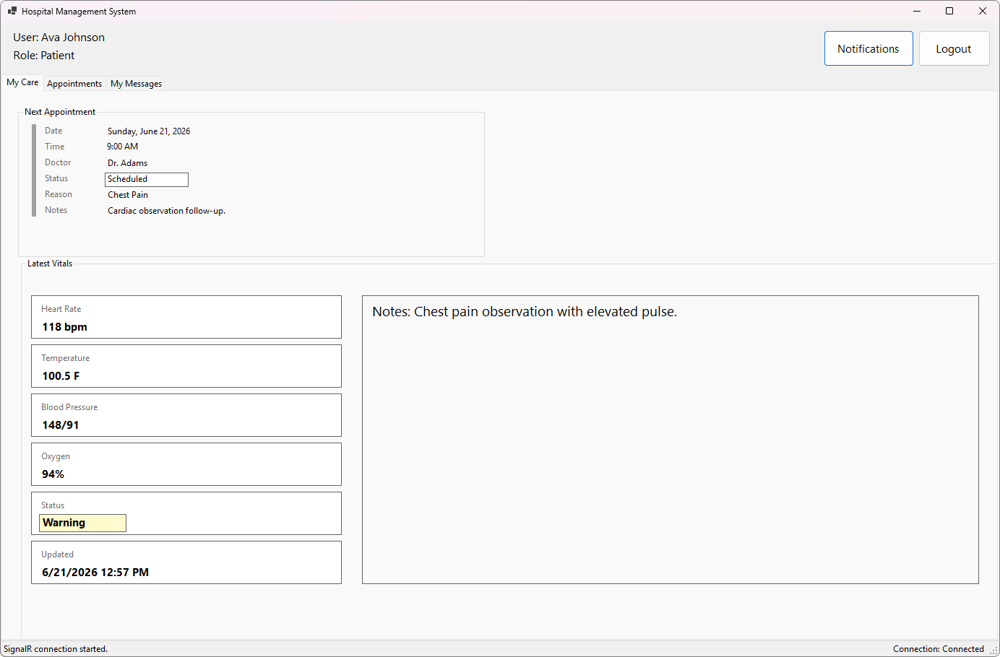

# Hospital Management System

This solution is a DEV420 final project for a Hospital Management System with real-time capabilities.



*Patient My Care screen: patients can review their next appointment, latest vitals, care status, and notes.*

## .NET Version

The projects currently target .NET 8:

- `HospitalManagement.Server`: `net8.0`
- `HospitalManagement.Client`: `net8.0-windows`

Install the .NET 8 SDK to build and run the solution.

## Projects

- `HospitalManagement.Server` - ASP.NET Core web project that hosts the backend, SignalR hub, MongoDB account checks, and real-time update flow.
- `HospitalManagement.Client` - Windows Forms desktop project for hospital staff and patients to use the system.

For detailed app roles, tabs, and workflows, read [DOCS.md](DOCS.md).

## Requirements

- Windows VM or Windows machine for running the WinForms client.
- .NET 8 SDK.
- Microsoft SQL Server (MSSQL).
- Microsoft `sqlcmd`.
- MongoDB server.
- MongoDB Shell `mongosh`.

`mongosh` is required for both scripted and manual setup because MongoDB reset and demo-user loading use MongoDB Shell commands.

## Setup Guide

Start with the solution-level [appsettings.json](appsettings.json). Both the server and client use this file.

Confirm or edit these values before creating the databases:

- `ConnectionStrings:HospitalSqlConnection` - SQL Server connection string for `HospitalManagementDB_SQL`.
- `ConnectionStrings:MongoConnection` - MongoDB connection string, usually `mongodb://localhost:27017/HospitalManagementDB`.
- `MongoAccount:DatabaseName` - MongoDB database name, usually `HospitalManagementDB`.
- `MongoAccount:UsersCollection` - MongoDB users collection, usually `Users`.
- `SignalRHubUrl` - server SignalR hub URL, usually `http://localhost:5068/hospitalHub`.

### Option 1: Scripted Database Setup

From the solution folder on the Windows VM, run:

```bat
Setup-HospitalDatabases.cmd
```

Use the menu in this order:

1. Option `1` resets SQL Server and MongoDB.
2. Option `2` creates the SQL Server schema.
3. Option `3` populates SQL Server demo data and MongoDB demo users.

The setup script reads connection values from `appsettings.json` and runs these files:

- `SQL setup files/HospitalManagementDB_SQL_Setup.sql`
- `SQL setup files/HospitalManagementDB_SQL_Populate_Demo.sql`
- `SQL setup files/HospitalManagementDB_Mongo_Populate_Demo.js`

### Option 2: Manual Database Setup

Use the same database names and connection values from `appsettings.json`. The SQL commands below run against Microsoft SQL Server (MSSQL) with `sqlcmd`.

Run the SQL schema script:

```bat
sqlcmd -S "<sql-server>" -d master -b -U "<sql-user>" -P "<sql-password>" -C -v DatabaseName="HospitalManagementDB_SQL" -i "SQL setup files\HospitalManagementDB_SQL_Setup.sql"
```

Run the SQL demo data script:

```bat
sqlcmd -S "<sql-server>" -d master -b -U "<sql-user>" -P "<sql-password>" -C -v DatabaseName="HospitalManagementDB_SQL" -i "SQL setup files\HospitalManagementDB_SQL_Populate_Demo.sql"
```

If you use Windows authentication instead of SQL authentication, replace `-U "<sql-user>" -P "<sql-password>"` with `-E`.

Reset MongoDB manually if needed:

```bat
mongosh "<MongoConnection>" --quiet --eval "db.getSiblingDB('HospitalManagementDB').dropDatabase();"
```

Load MongoDB demo users:

```bat
set "HOSPITAL_MONGO_DATABASE=HospitalManagementDB"
mongosh "<MongoConnection>" --quiet --file "SQL setup files\HospitalManagementDB_Mongo_Populate_Demo.js"
```

Replace `<MongoConnection>` with the `ConnectionStrings:MongoConnection` value from `appsettings.json`.

## Run the App

Start the server first:

```bash
dotnet run --project HospitalManagement.Server
```

Then start the Windows Forms client on Windows:

```bash
dotnet run --project HospitalManagement.Client
```

Log in with a MongoDB user. Demo accounts use password `123`; examples include `admin`, `taylor`, `adams`, `chen`, `ava`, and `marcus`.

## Build

Run this from the solution folder on the Windows VM:

```bash
dotnet build DEV420-FinalProject.sln
```
